# AutoLL-5 User Guide

AutoLL-5 books Walt Disney World Lightning Lane Multi Passes from the phone in
your pocket while you are in the park. You tell it which attractions you want,
in what order, and between which times; it watches Disney's tip board and takes
what appears — including in the two-second window when a scheduled drop lands.

This guide is in three parts: what to do **before the trip**, what to do **on
the park day**, and **what to do when something goes wrong**. A reference
section at the end collects the numbers.

Two things are true of the whole app and worth reading first:

- **It cannot get you more than Disney's rules allow.** Three Multi Pass
  selections at a time, one Tier 1 until somebody taps in, one booking per
  attraction per day. What it has over you is that it is faster and more
  attentive than you are at 7:00:02.
- **Keep Disney's own app as the source of truth.** AutoLL-5 is unofficial,
  experimental, and can stop working the day Disney changes an endpoint. When
  the two disagree about what you hold, Disney is right.

> **About the screenshots.** Every picture here comes from the preview harness
> (`npm run harness`), which runs the real screens against fake Disney clients.
> The data is invented: the party is Mickey, Minnie and Pluto, and the clock
> drifts a minute or two between shots, so times do not line up from one figure
> to the next. Where a screenshot shows text the running app would never
> produce, the caption says so.

---

# Part 1 — Before the trip

Do all of this at home, days or weeks ahead. The mistakes that cost you a
park morning get made weeks before it.

## 1. Install it

Open the [setup page](https://mbs1234.github.io/AutoLL-5/) **on the phone you
will actually carry in the park** — not on a laptop. The whole app is built for
a phone-width screen.

There are two ways in:

| | **Bookmarklet** | **Userscript** |
|---|---|---|
| What it is | A bookmark you tap | A script that injects itself |
| When it runs | Only when you tap it | Automatically on Disney's Lightning Lane pages |
| Needs | Nothing | A userscript manager (Userscripts on iOS, Tampermonkey on Android) |

Pick the userscript if you want AutoLL-5 to appear by itself; pick the
bookmarklet if you would rather decide each time.

**Install only one AutoLL userscript.** AutoLL-5, AutoLL-3, AutoLL-4 and AutoLL
v1.0 all match `disneyworld.disney.go.com/vas/`, so multiple enabled autoloaders
fight over the page. Multiple *bookmarklets* are fine — each only runs when
tapped.

**Nothing carries over from the other builds.** AutoLL-5 keeps its storage under
`autoll5.*` and never reads the other builds' keys. It starts completely empty:
no party, no watch list, not even the accepted warning. Their data is untouched,
but you rebuild here from scratch. Do it now, not at the gate.

**Telling the builds apart.** AutoLL-5 names its browser tab `AutoLL-5`; the
build name is also the last line of the Settings menu. It uses a palette favicon
(🎨), while AutoLL-3 uses a flask, AutoLL-4 a DNA helix and v1.0 a bolt.

## 2. First run

Run the bookmarklet on a page whose address begins `disneyworld.disney.go.com`.
On any other Disney page the tab is silently sent to AutoLL-5's start page
instead — if your tab suddenly becomes a GitHub Pages page, that is what
happened.

**The warning screen.** A red screen headed "Warning!" says the app is
experimental, unofficial and unwarranted. Tap **Accept** at the bottom. It never
appears again in that browser.

**Signing in.** AutoLL-5 never asks for your Disney password. It loads Disney's
own OneID sheet, which opens by itself, and Disney hands back a session token
that is held in your browser only. If the sheet does not load, the card gives up
after fifteen seconds and offers a retry button — that is the fix for the blank
white screen v1.0 used to leave you on. If you close Disney's sheet on purpose,
it stays closed.

If it asks you to sign in again, a line under the heading says why:

| Line | What it means |
|---|---|
| "Your Disney session has expired." | The token ran out — or you tapped Log Out |
| "Your saved session ends before 5:00 PM park time. Sign in again before using Autopilot." | Still valid now, but it will die this afternoon |
| "Your saved session could not be read safely." | The stored record failed its shape check |

The five-o'clock refusal is the one worth acting on. Sign in again at breakfast;
it costs a minute then and saves you discovering a dead session at 2pm in a
queue.

## 3. Pick your party

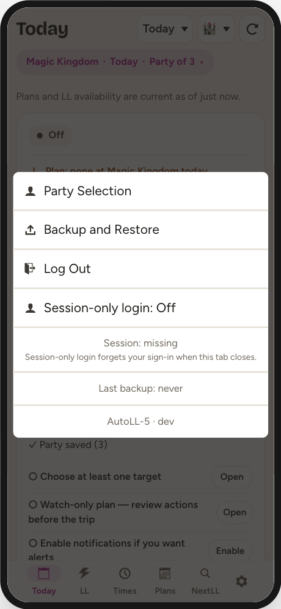

Tap the **gear** at the right-hand end of the bottom tab bar → **Party
Selection**. Choose "Only book for selected guests" and tick the people you
actually want, then **Save**. After that, anyone outside your saved party is
shown on booking screens under Ineligible Guests marked `NOT IN PARTY`.

The same menu carries **Backup and Restore** (see *It cannot protect its own
storage*, below), **Log Out**, a **Session-only login** switch for a borrowed
phone (the token then lives only as long as the tab), a `Session:` line telling
you whether you are signed in, a `Last backup:` line, and the build name.

> The Party Selection screen says the cap is 12 guests. At Walt Disney World it
> is actually 20 — the 12 is left over in shared code. In the harness screenshot
> above, `Session: missing` is simply because the harness never signs in; on
> your phone it will read `Session: valid`.

## 4. Choose the park and the day

The header of the Today tab carries a **date** control and a **park** control.
Everything below them — the watch list, the plan, the timeline, the checks — is
scoped to that one park on that one day.

This is the single most important idea in the app. A plan you build for Tuesday
at Magic Kingdom is inert on Thursday at Epcot. That is deliberate: on Tuesday,
nothing Epcot-shaped can spend an action. But it also means a plan can look
empty simply because you are looking at the wrong day.

The date picker offers 22 days as an upper bound. Most of those are not
bookable for most guests; requests for them simply fail.

## 5. Build the watch list — the Configure screen

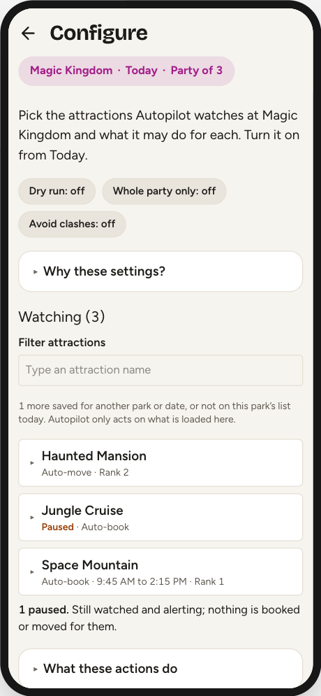

Today tab → **Configure**. This is where the plan lives. Nothing here starts
anything: the screen is inert until you turn Autopilot on from Today.

### Adding an attraction

Scroll to **Lightning Lane attractions** at the bottom and tap the ☆ beside a
name. It moves up into **Watching (N)** and its card opens so you can set it up.
The **Filter attractions** box narrows both lists.

A newly added target starts with **every action off** — it only watches and
alerts. That is on purpose: alerting and booking are separate decisions.

### The five actions

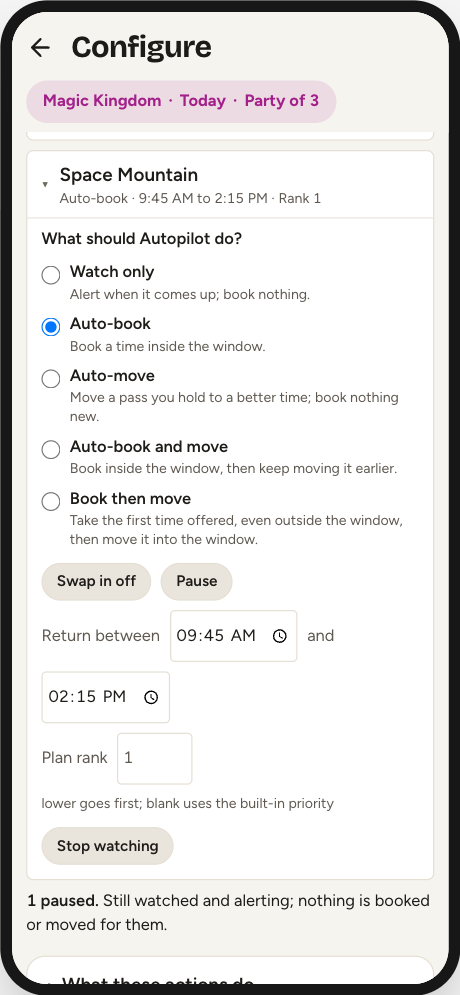

Tap a card to unfold it. Five chips:

| Chip | What it does |
|---|---|
| **Auto-book** | Books it without asking, the moment a return time inside its window is offered |
| **Auto-move** | For a pass you already hold, moves it earlier when a better time appears — but only for a gain of **30 minutes or more**, and never later |
| **Book then move** | Takes the first time offered **even outside your window**, so you hold something, then works to move it in |
| **Swap in** | When all three slots are full, gives up your lowest-ranked held pass to take this one |
| **Pause** | Keeps it watched and alerting while nothing is booked or moved for it |

Things worth knowing:

- **Book then move ignores your window for the first booking.** If a bad return
  time is worse than none, do not arm it. Once something is held, the window
  governs the move again.
- **Swap in gives up the reservation the *app* ranks worst**, preferring a
  non-Tier-1 — not the one with the highest Plan rank you typed. The swap is a
  single request, so you can never end up holding neither.
- **Book then move and Swap in each imply booking**, so an attraction can be
  booked with Auto-book off.
- **Pausing keeps everything you armed.** The chips stay on, they just do not
  fire. Resuming brings the plan back exactly as it was.

There is a sixth chip, **Passkey**, on non-Tier-1 attractions only — see
[The passkey](#the-passkey) below.

### Return-time window

"Return between [time] and [time]". Leave either side blank for no bound.

A window **limits what Autopilot will take, not what it tells you about.** An
attraction outside its window still alerts, so a window can never hide the fact
that something came back.

> Clearing a bound to retype it does not take effect until you leave the field.
> That is deliberate: backspacing over `15:00` to type `14:00` used to hand
> Autopilot an unbounded window for as long as the field was empty — and during
> a drop burst the poller ticks about once a second.

### Plan rank

Your own priority order. Lower goes first when two attractions come back in the
same moment. Leave it blank to use the app's built-in ranking — which is the
same "Priority" sort the LL tab shows, so the engine always agrees with the list
you are looking at.

Rank also decides whether Autopilot passes on a Tier 1 offer to keep the slot
for a better-ranked Tier 1. It does **not** decide which reservation a swap
gives up.

### Stop watching

Inside the card, at the bottom. Removal is inside the card on purpose, so a
mis-tap on the list cannot lose a window and a rank. An **Undo** strip appears
for **8 seconds** and remembers only the most recent removal — remove a second
attraction and the first one's undo is gone.

### The three safeguards

At the top of Configure, applying to everything:

| Chip | Default | What it does |
|---|---|---|
| **Dry run** | Off | Rehearsal. Every check runs and the log says what it *would* have done; nothing is booked |
| **Whole party only** | Off | Refuses to act unless everyone in your party is eligible |
| **Avoid clashes** | Off | Refuses a return time that lands on top of something you already hold, dining included |

All three safeguards start off. Each turns on only when you explicitly enable
it, and an existing installation keeps the value it already saved.

Booking by hand only *warns* about an overlap and lets you book anyway. Here it
skips instead, because there is nobody to warn.

### Colour means something

- **Blue** — an action that can spend an entitlement
- **Green** — a safeguard narrowing what may happen
- **Yellow** — rehearsal (dry run)
- **Amber** — paused
- **Red** — reserved for Stop, errors and blockers

Every chip also keeps "on" or "off" in its own text, so colour never carries the
state alone.

## 6. Check it — Plan Check

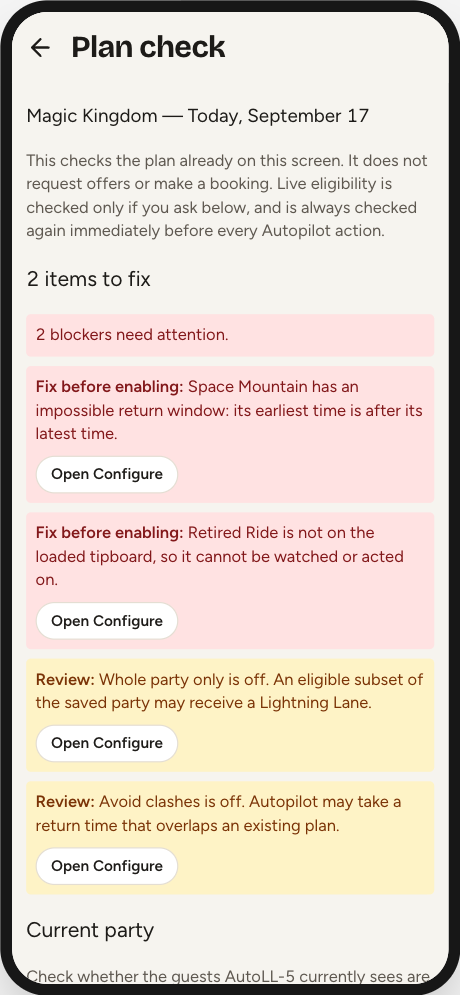

Today tab → **Plan check**. It reads the plan already on screen and returns
blockers first. **Opening it asks Disney for nothing** — it judges only the
configuration and data the app already has.

Blockers ("Fix before enabling:"):

- No saved targets apply to this park and date
- A target is not on the loaded tip board — usually a re-themed ride with a new
  internal ID
- An impossible return window — earliest after latest
- A window that falls **entirely** inside the protected time around a plan you
  already hold, so every time it allows would be refused

Reviews ("Review:"):

- Part of a window clashes with a held plan
- The tip board has not loaded
- Dry run is on
- Nothing is armed to act
- An armed attraction is paused
- More than one Tier 1 target armed to book
- Whole party only is off / Avoid clashes is off

Most items carry an **Open Configure** button; items about the tip board carry
**Refresh LL list**, which is one of only two things on this screen that go to
the network. The other is **Check current party** at the bottom, which asks
Disney whether your saved guests are generally eligible — it cannot create an
offer and cannot spend an entitlement.

> A green "Ready" means the plan is internally *consistent*, not that a
> Lightning Lane exists. Eligibility, inventory and the offer's real return time
> are checked again immediately before every action.

> Two rough edges visible in the screenshot: with exactly one blocker the bar
> reads "1 blocker need attention." (the verb is not pluralised), and the
> **Open Configure** buttons sit inline inside the sentence, so text wraps around
> them. "Retired Ride" is the harness's fake data, not a real attraction.

## 7. See it — the Timeline

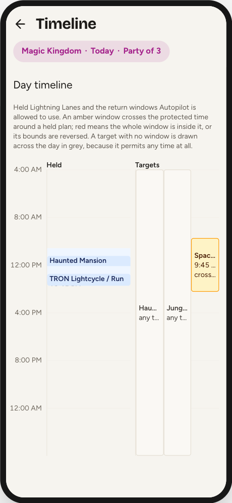

Today tab → **Timeline**. Your held passes down the left, the windows Autopilot
may use down the right, both on one 4am-to-4am rail.

The pale band behind each held pass is the **protected time** around it: 40
minutes before the return time, and after it 60 minutes when the pass has no
known end or 40 when it does. A window drawn over that band is a window
Autopilot will mostly refuse.

Colours on the Targets column:

- **Green** — both bounds set, clear of every held Multi Pass
- **Amber** — "crosses a held plan"; part of the window is still usable
- **Red** — "window fully blocked", or "bounds reversed"
- **Grey** — "any time"; no window, so it permits everything

Tap a bar to jump to that pass, or to that target's card in Configure.

Three limits worth knowing:

- **Lunch is not on the timeline.** Only Multi Passes are drawn, and only they
  colour the windows. A dining reservation constrains your bookings without
  appearing here — which is why Plan Check can call a target blocked while the
  timeline shows it only amber. Treat the timeline as the picture and Plan Check
  as the verdict.
- **A half-set window reads as no window.** Set only an earliest time (or only a
  latest) and the bar is drawn grey across the whole day, uncoloured and
  unflagged — even though Autopilot does enforce the bound you set.
- **Names are truncated.** In the screenshot above every Targets label reads as
  three characters. Tap a bar to find out which attraction it is. This is a
  known rough edge, recorded in `docs/FUTURE.md` §2.1.

## 8. The pre-trip checklist

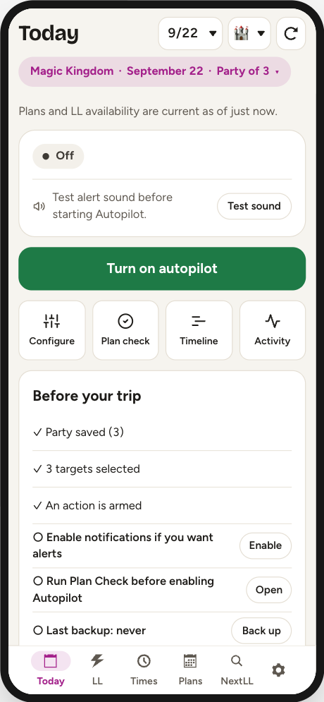

When the day on screen is **not today**, the Today tab becomes a readiness list.
Five items, each with a button that opens the screen that fixes it:

- Party saved
- At least one target selected
- An action actually armed
- Notifications allowed
- Plan Check reviewed

It is a local readiness summary, not a live check of Disney — it makes no
requests. The panel disappears the moment the booking date is today.

> The "Plan Check reviewed" tick is not saved. Reload the page and it reverts.

## 9. The night before

- Re-check the **park and date** in the header.
- Run **Plan Check** and clear the blockers.
- Confirm **Dry run** is off if you want it to act — dry run survives reloads
  and a new park day, which is exactly why it is shown so loudly.
- Sign in again if the session line warns it ends before 5pm.

---

# Part 2 — On the park day

## 10. Starting up

Launch AutoLL-5 the way you installed it. You land on the tab you were last on —
usually **Today**.

**Autopilot always starts off.** The on/off state is deliberately not
remembered: a page reload leaves it off, and so does the 4am park-day rollover.
That asymmetry is what makes persisting per-attraction Auto-book safe.

## 11. Reading the Today tab

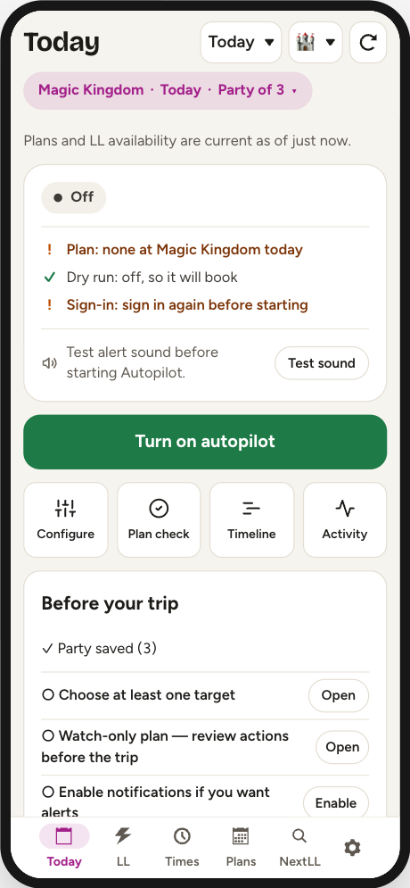

Top to bottom, Today answers the questions you actually ask in a queue.

**The freshness line.** "Plans and LL availability are current as of just now."
This is the line that tells you whether to believe the rest of the screen. If it
is climbing, tap the refresh button in the header. If there is **no line at
all**, neither list has ever loaded — that is not the same as fresh.

**Held (N)** is what you are actually holding, at every park on that date.
**Plan (N)** is what Autopilot is still after, for the park in the header only.
The two lists are scoped differently on purpose, which is why you can see
"Held (2)" above "Nothing watched at Magic Kingdom on this date."

**The four buttons** — Configure, Plan check, Timeline, Activity — are the
screens Today deliberately does not try to be.

**Next Lightning Lane / Next drop** are the two times that decide when anything
can happen: when your next booking window opens, and the park's next scheduled
drop.

## 12. Turning Autopilot on

The big button in the middle. That one tap does four things: starts the loop,
unlocks the alert chime, asks the browser for notification permission, and asks
the phone to keep the screen awake. That is why it has to be a deliberate tap
and not a toggle in the header.

Turning it on starts a **fresh run**: the session log, skip counts, refusal
state, per-run locks and the drop-detection baseline are all cleared, and
anything already available gets re-alerted.

**Check the sound before you rely on it.** Under the notification notices
Today says whether the alert sound is armed, with a **Test sound** button next
to it. On iOS the chime is not one channel of three — notifications need the
page installed to your Home Screen, and vibration is unimplemented — so if the
sound is not armed during a run, nothing can reach you. While Autopilot is off,
Today presents this as a neutral pre-flight check rather than a fault. Tap
**Test sound** before starting, and again after any interruption if you want to
verify it manually. If you hear two notes, the channel works.

> **Autopilot only runs while the page is open and in front of you.** Lock the
> phone or switch apps and the browser throttles its timers to minutes. The
> screen wake lock exists to prevent exactly this, and it is best-effort.
> Today says **Screen is being kept awake** while it is held and warns
> **Screen may sleep** when the browser supports the lock but has not granted
> one. That row appears only while Autopilot is on, because an idle wake lock is
> expected when no checks are running.

### Put the running phone in your pocket

Once Autopilot is on, tap **Pocket it**. The full-screen guard leaves the
poller and notifications running while preventing the live glass from reaching
the controls underneath it. It also blocks page scrolling and pull-to-refresh;
a reload would turn Autopilot off.

To lift the guard, tap the moving circle three times. The three clean taps must
land within **10 seconds**. A miss, second finger, drag or cancelled gesture
clears all progress, and the target moves after each accepted tap.

If the phone reports your fingertip as unusually large, keep using one finger
and follow the moving circle. Three large-contact taps within **20 seconds**
lift the guard through its escape path. It allows a little more movement, still
resets on a miss or second contact, and remembers your phone until the page is
reloaded so re-pocketing does not make you repeat a separate setup.

The guarded screen is also a status display. It shows the current checking
pace, the number of targets that can actually act, today's booking count, and a
line such as **Sound on · Screen held**. A red **No sound** or **Screen may
sleep** means to lift the guard and check the named channel; the status follows
the browser directly rather than waiting for the next poll. If Autopilot stops
or the 4am rollover turns it off, the guard changes to a red warning. Lift it
and deliberately start a new run; an off or stopped guard is not still
checking.

### Lock the phone to Safari with Guided Access

Pocket mode guards the page. It cannot guard Safari's own toolbar, because no
web page can cover or disable browser chrome — and the **back** button is the
one that really hurts, because it navigates away and destroys the run. iOS
**Guided Access** is what stops a pocket reaching it.

**Set it up once.** Settings → Accessibility → **Guided Access**, turn it on,
then:

- **Passcode Settings** — set a passcode and turn on **Face ID**, so ending a
  session is a triple-click and a glance rather than typing in bright sun.
- **Display Auto-Lock** — set it generously (**Never**, or the longest
  offered). This is separate from the app's screen wake lock, and you do not
  want the two arguing.

**Each time you pocket the phone.** Start Autopilot, tap **Pocket it**, then
triple-click the side button (double-click on iOS 18 and earlier). On the
Guided Access screen, circle the areas to disable with your finger, then tap
**Start**. iOS remembers the regions per app, so you draw them once.

**What to circle:**

- **The bottom strip** — on Safari's default layout this holds the address bar,
  back, forward, share, bookmarks and tabs.
- **The top strip** — the status bar and the notch. Check which Safari layout
  you use first: if you moved the address bar to the top, this matters as much
  as the bottom.

Leave the middle alone. That is where AutoLL-5 is.

**Two ways to run it.** Circle the strips and leave touch on, and Pocket mode
still works normally — three taps lift the guard and you can check on things
without ending the session. Or open **Session Settings** and turn **Touch**
off, and nothing on the glass responds at all; you can still read the guarded
screen, and you triple-click to end Guided Access when you want to interact.
The first is more convenient, the second is airtight. They are alternatives,
not layers: with Touch off, the three-tap unlock cannot work either.

**To end it,** triple-click the side button, authenticate, then **End**.

> **Crash Detection and emergency calls do not work during a Guided Access
> session.** Apple states this outright. End the session rather than leaving it
> running all day out of habit.

## 13. What the status words mean

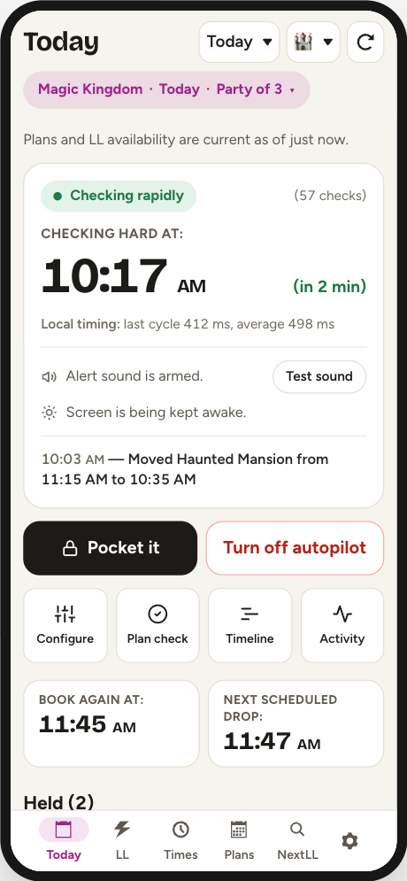

| Status | Pace | When |
|---|---|---|
| **Off** | — | Not running |
| **Watching** | ~45 s | Nothing near |
| **Checking often** | ~6 s | 5 to 2 minutes before a target, or inside a refill window |
| **Checking rapidly** | ~1.2 s | From 2 minutes before a target to 2 minutes after |
| **Stopped after repeated errors** | — | Eight checks failed in a row |

Beside it, `(57 checks)` counts the checks since you turned it on — **the
simplest proof it is alive is that number rising between visits.**
`Local timing: last cycle 412 ms, average 498 ms` is how long a check is taking
on your connection; a sudden jump means slow wifi, not a bug.

The bold coloured line above the status is **history** — the last thing
Autopilot actually did, with a time. It survives switching Autopilot off,
because the day's log is saved. Only the Status block is live.

> Two things labelled "Next drop" on this screen are not the same. Inside the
> Status block it is whatever moment the poller is chasing — which can be a
> booking window or a drop the app has learned by observation. Lower down it is
> the built-in table only. In the screenshot they read 10:33 AM and 11:47 AM;
> that is not a bug.

**How to tell it is working.** Freshness line recent → button red → Status not
"Off" or "Stopped" → check counter rising. If all four look healthy and nothing
is booking, look for the red refusal box, then the amber "failed checks in a
row" line, then the yellow dry-run banner, then the "n armed" count in Plan. A
running Autopilot with **0 armed** will never book anything.

### Dry run

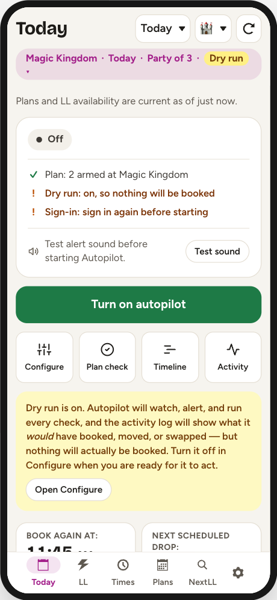

"Dry run is on. Autopilot will watch, alert, and run every check, and the
activity log will show what it *would* have booked, moved, or swapped — but
nothing will actually be booked."

Rehearsal runs the same pre-offer guards as the live path. The one thing it
cannot test is the real time Disney would have offered, because getting that
costs a real request. Turn it off in Configure.

## 14. Around a drop

You do not have to do anything. Autopilot carries a table of the minutes Disney
tends to release extra inventory, per park, and bursts at all of them:

| Park | Attraction | Drop times |
|---|---|---|
| Magic Kingdom | Tiana's Bayou Adventure | 09:47, 11:47, 13:47, 14:17, 15:47, 17:47, 19:47, 21:47 |
| EPCOT | Test Track | 08:47, 12:47, 14:47, 17:47 |
| Hollywood Studios | Millennium Falcon | 10:47, 15:47 |
| Hollywood Studios | Slinky Dog Dash, Toy Story Mania, Tower of Terror | 13:17, 15:47 |
| Animal Kingdom | Expedition Everest | 08:47, 12:47, 14:47, 15:47 |
| Animal Kingdom | Kilimanjaro Safaris | 09:47, 12:47 |
| Animal Kingdom | Kali River Rapids | 13:47 |

**The burst is park-wide.** If any attraction in the park drops at 13:47,
Autopilot bursts at 13:47 even if you are not watching that ride. It starts two
minutes early because Disney releases drop inventory early often enough that
arriving at the advertised minute is arriving late.

**Refill windows** are different. Nine attractions trickle inventory back over
hours rather than dropping at an instant, and for those Autopilot holds the
6-second pace for the whole span — **but only if that attraction is on your
watch list**, unlike drops:

- **09:00–10:30** — Test Track, Slinky Dog Dash, Toy Story Mania, Tower of
  Terror, Na'vi River Journey
- **11:00–14:30** — Jingle Cruise, Jungle Cruise, Peter Pan's Flight, Mickey &
  Minnie's Runaway Railway

Outside those nine drop minutes, a return time appearing is somebody
cancelling — and forty-five seconds is how you miss it.

### The Tier 1 hold

Disney lets a party hold one Tier 1 selection at a time until the party's first
redemption. So Autopilot will **decline a Tier 1 it could take** if a Tier 1 you
ranked higher has a drop coming within **90 minutes**. Past that horizon the
hold releases on its own.

It shows up in Activity as "held the Tier 1 slot for a better attraction".
Pausing the attraction you want less removes the hold.

### The passkey

Mark one easy, high-availability, **non-Tier-1** attraction as the day's
passkey, in its Configure card. Autopilot books it first; once Disney's own
tracker says that entitlement is spent, it asks the eligibility endpoint whether
the one-Tier-1 rule has actually lifted for everyone in your party.

> Booking the passkey does nothing. It unlocks only when the pass is actually
> *spent* — and Disney counts a window you let lapse the same as one you rode,
> so Autopilot cannot tell those apart.

## 15. The LL tab — the tip board

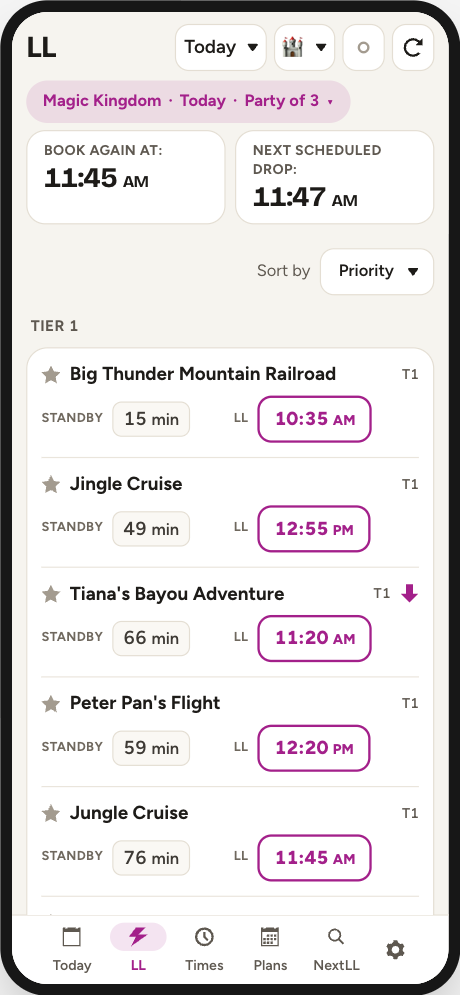

One row per attraction: a ☆ favourite, the name, a tier badge, the current
**STANDBY** wait, and an **LL** button showing the next return time. Tap that
button to start booking.

The banner under the header reads `BOOK:` and `DROP:` — the next moment you may
book, and the park's next drop.

**Sorting.** The second header control offers Priority (the app's own ranking),
Nearby (closest first, today only), Standby, Soonest, and A to Z. Whatever you
choose, attractions with no availability sink to the bottom, and sorting never
crosses a tier boundary.

**Symbols.** ⚡ is a Lightning Pick — a long standby wait paired with a soon
return time. ⬇ means an upcoming drop (solid = the next one, faded = a later
one). ✓ means you already hold a pass. A **green bar** down the left edge means
this attraction is available earlier than a pass you already hold in that
tier — the one cue with no legend entry.

The clock button between the park picker and refresh is the **Autopilot status
light**: green running, yellow dry run, red stopped, plain off, with the number
of attractions being watched. Tapping it opens Today; it is navigation only, so
a mis-tap can never change what gets booked.

> Sold-out attractions still appear, reading "none". A ride Disney has re-themed
> under a new internal ID vanishes from this list silently — the warning for that
> is on Today.

## 16. Booking by hand

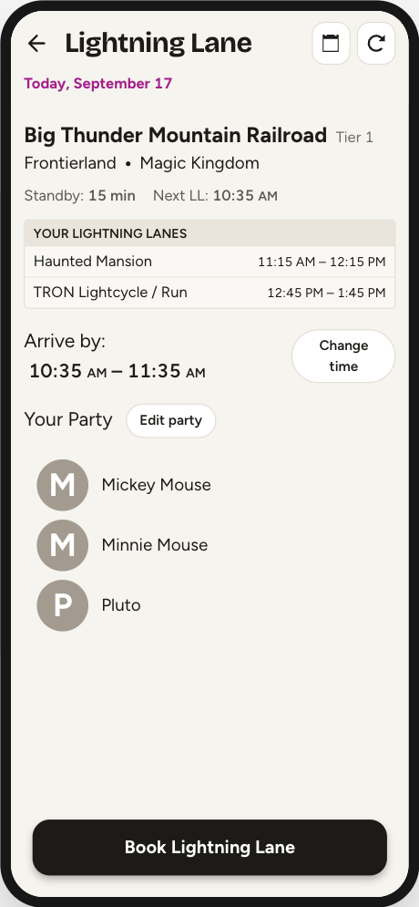

Tap any LL time on the tip board. You get the attraction, its land and park, a
box listing the passes you already hold that day, the offered window as
**Arrive by: 10:54 AM – 11:54 AM** with a **Change** button, and **Your Party**
with a **Modify** button. The button at the bottom commits.

- **Change** opens a grid of return times by hour. Tick **Show all** to see
  ten-minute slots across the whole day — those are the app's educated guesses,
  not Disney's real inventory, and picking one that does not exist gets you the
  nearest one that does.
- **Modify** trims the party. Adding someone who was not previously selected
  fetches a fresh offer, so the return time can change; removing guests leaves
  the offer alone.

If the offer goes stale between loading and tapping Book, you get a red "Offer
expired — refreshing…" flash and a new offer is fetched — **check the new time
before tapping Book again.**

Three dead ends you may land on instead: **No Guests Found** (a network blip —
Try Again), **No Eligible Guests** (often with an "Eligible at 11:56 AM" note),
and **No Reservations Available** (not enough slots for the whole party — trim
it and check again).

## 17. The Plans tab

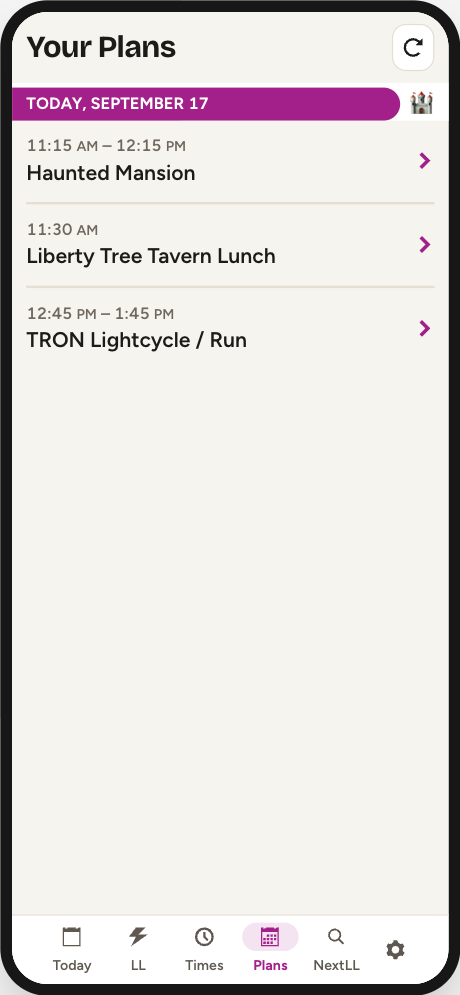

Your whole itinerary as the app last read it: Lightning Lanes, DAS selections,
dining, boarding groups, grouped by park day. Tap any row for details.

Only **Multi Pass Lightning Lanes** can be changed here. Dining, park passes,
boarding groups and Multiple Experiences passes are read-only however they look.

On a Multi Pass's details screen:

- **Change** — a different return time for the same attraction
- **Modify** — hand the pass back to the booking flow to trade it for a
  different attraction, keeping it held until the replacement is booked
- **Cancel** — remove chosen guests, or the whole reservation when you remove
  everyone

> **Cancelling has no "are you sure" step**, and if the request fails the app
> still backs out and redraws the party as though the guests had gone. Reopen
> the booking from Plans to see what really happened.

> Plans mirrors Disney; it is not live. A pass cancelled on another phone will
> not disappear until you refresh.

## 18. The Times tab

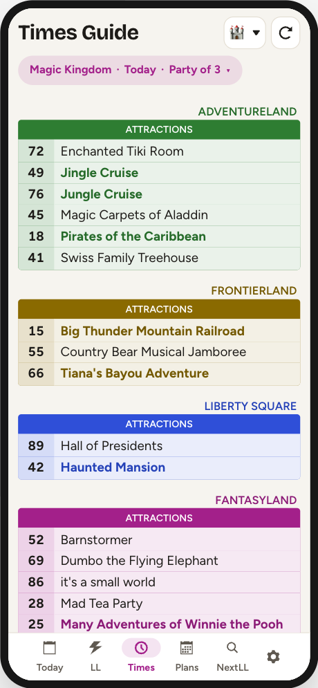

A read-only park guide: standby waits, show and character times, and Individual
Lightning Lane prices, grouped by land. Names in bold and in the land's colour
are the ones the data file flags as popular.

Symbols: `–` no posted wait, `❌` showing but standby not open, `VQ` virtual
queue only.

This tab is also the **only** way to request a DAS return time: a **DAS** button
appears in the header if Disney reports at least one registered party on your
account. (An existing DAS selection also opens from Plans and the Timeline.)

> The harness cannot show show-times, DAS or ILL prices — its fake clients
> return nothing for those — so the screenshot above is waits only.

## 19. The NextLL tab

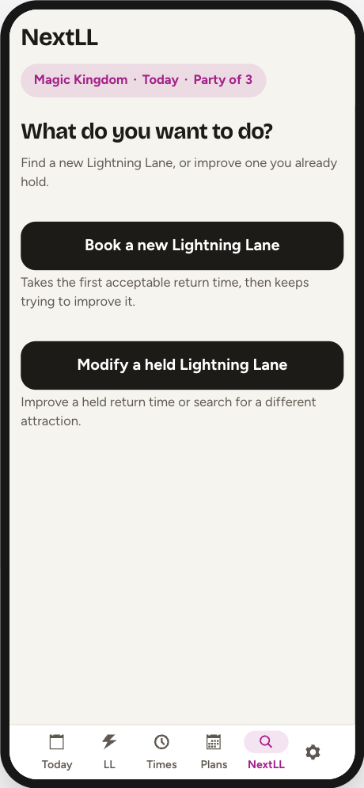

NextLL is the "I want *this* ride, now" engine — one attraction, one optional
window, one button, and you stand there watching. It is a second booking engine
running inside the app's own, deliberately kept apart from Autopilot: its own
watch list, its own storage, its own poller. A quick search can never add to,
arm, or switch off your day plan.

**Book a new Lightning Lane** picks one attraction and takes the first time it
can get, then keeps trying to move it earlier — checking about every 0.6
seconds.

Two traps worth knowing:

- **"Return by 1pm" does not mean it will only book before 1pm.** With nothing
  held the window is stripped and it takes whatever is offered — even 7pm — and
  only then starts moving it toward your window.
- **"Return after" is the opposite trap.** Setting a lower bound turns the
  window into a filter on the *booking*, so the search can spend the morning
  refusing everything earlier than your bound and holding nothing at all. For a
  later return use Time Search instead.

**Leaving the tab stops the search.** It is remembered: come back, tap "Book a
new Lightning Lane" again, and a card offers to resume. Today also shows a
reminder card with an "Open NextLL" button.

**It never stops itself when it succeeds.** Once the goal is met the button
reads "Done" but it keeps checking until you tap it.

**Modify a held Lightning Lane** lists the passes you hold and leads to the two
search screens below.

**When two people hold the same ride.** If more than one person holds the
attraction at different times, NextLL works on the reservation your **saved
party** holds. With no party saved, or a party that includes both, it cannot tell
which you mean, so it says so and lists who holds what: save a party of only the
people whose reservation should move — the gear, then **Party Selection** — and
start again. Autopilot follows the same rule, and Plan Check warns about it
ahead of time.

## 20. Time Search

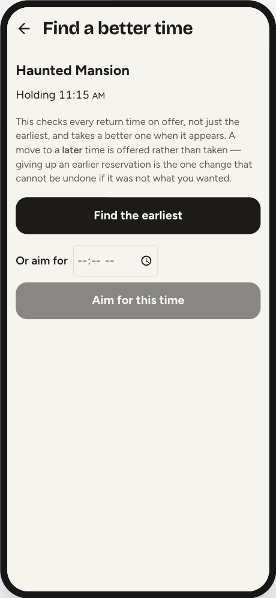

NextLL → Modify a held Lightning Lane → pick one → **Improve return time**. Also
reachable from a held pass: Plans → the row → **Change** → "Search for a better
time". It works on the pass you opened it from, even when someone else in your
party holds the same ride at another time.

This is the one screen that can do what Autopilot structurally cannot. Autopilot
sees only the single earliest time the tip board advertises, so it can only pull
a pass **earlier**. Time Search opens a real modify offer and reads the **whole
return-time grid** behind it, so it can walk a pass in either direction toward a
time you type in — including **later on purpose**, for a dinner reservation.

- **Find the earliest** chases the soonest slot.
- **Or aim for** + **Aim for this time** walks toward a named time, accepting
  gains as small as five minutes, and stops with "That will do — the reservation
  is at the time you asked for."

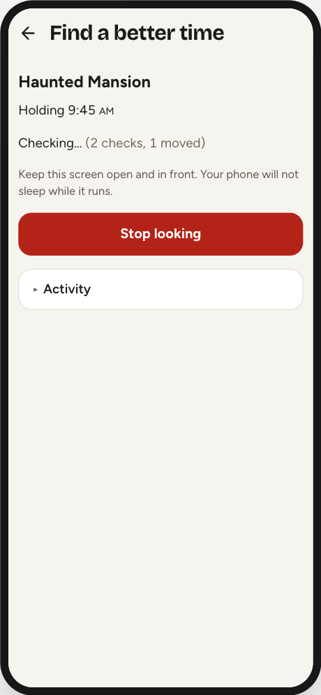

**A later move is offered, never taken.** When the best move toward your target
is a later slot, an amber box appears: "A later time is available: … Taking it
gives up the earlier reservation you hold now." with a **Take it** button.
Nothing is held for you while it waits — the slot can be gone by the time you
tap. The move is made on the next cycle, up to six seconds later, and the screen
says "Moving to …" from the moment you tap.

Both searches take an exclusive, expiring lock on that one reservation from
their first attempted change, so Autopilot cannot touch it mid-search. If
Autopilot got there first you get an amber "Waiting for Autopilot to finish a
request…" box, and the search takes over as soon as that returns.

**Change attraction** is the sister screen: it hunts a replacement ride for a
pass you hold, and **always asks before replacing**, even if the offered time is
earlier. Once you tap **Replace Lightning Lane** it says it is replacing, then
that it is waiting for Plans, and finally **Replaced … Confirmed in Plans.**

## 21. The Activity screen

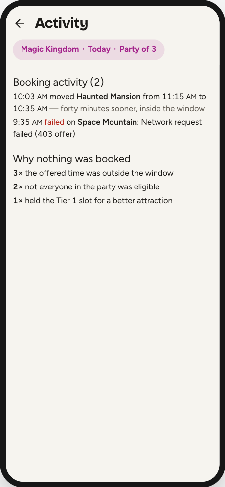

Today tab → **Activity**. Three sections:

**Booking activity (N)** — today's bookings, moves, swaps, rehearsals and
failures, newest first, capped at 20 rows. Repeated failures collapse to one row
with a `×47` count instead of flooding the log.

**Why nothing was booked** — a tally of every reason Autopilot decided not to
act, in plain English: "the offered time was outside the window", "not everyone
in the party was eligible", "held the Tier 1 slot for a better attraction", "it
clashed with something already booked", and a dozen more. **This is the answer
to "it's running, so why hasn't it booked anything?"** — skips are the normal
outcome and are kept out of the log so they cannot swamp it.

**Learned drop times** — what Autopilot has seen with its own eyes, against the
built-in schedule. A drop seen on **two different park days** becomes eligible
to join the times it bursts for. A red "never seen in 3 watched days" is
evidence for you, not an action it took: removing a built-in time is switched
off in this build.

> The log survives a reload; the skip counts do not — they are per-run and in
> memory. At 4am both reset and Autopilot switches itself off.

> In the screenshot above, "forty minutes sooner, inside the window" and
> "Network request failed (403 offer)" are harness fixture text. The running app
> writes one of three fixed justifications, and its failure rows read
> "Request failed (403)".

---

# Part 3 — When something goes wrong

## The one diagnostic

**Book a single Lightning Lane by hand and read the banner at the bottom of the
screen.** Everything else in this section is a variation on that one test.

| Banner | Meaning | What to do |
|---|---|---|
| `Network request failed (403 guests)` | Disney's filter is refusing this app | Stop trying; book in Disney's app. Leave AutoLL-5 running as a watcher |
| `Network request failed (no response guests)` | Your signal dropped — an 8-second timeout | Move, or switch wifi off. **If you were mid-booking, check Disney's Plans first** |
| `Too many requests just now.` | You tapped faster than 5 requests/second | Wait five seconds |
| `Unknown error occurred` | No status at all — usually the rate limit, on screens that do not name it | Wait five seconds and retry once |

The banner clears itself after three seconds and is stored nowhere. Miss it and
the only way to see it again is to repeat the action.

## Autopilot looks healthy but never books

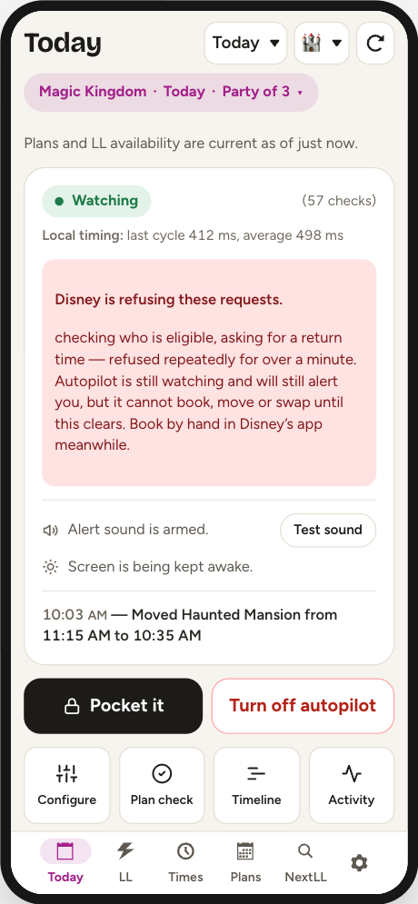

This is the failure mode to watch for. Disney's filter hits the **eligibility**
call first — one step before an offer exists — so Autopilot keeps polling,
keeps alerting and keeps learning drop times while never acting.

The red **"Disney is refusing these requests."** box on Today is the only thing
that names it. It waits a full minute before appearing, so it describes a
condition rather than a hiccup, and it only counts outright 403s. Book by hand
meanwhile; do not keep toggling Autopilot, because the refusal is Disney's.

## Autopilot stopped

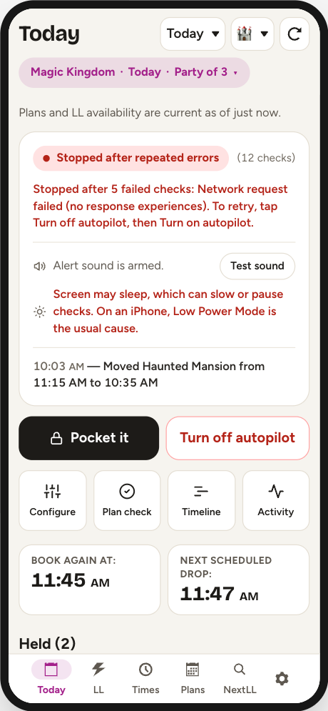

Eight checks failed in a row, so it gave up rather than spin. It is no longer
watching, alerting or booking, and **it does not restart itself.**

The switch still reads "Turn off autopilot", so restarting is **two taps**: off,
then on. (The exception is a stop caused by an expired session — signing back in
remounts the app with Autopilot off, so there it is one tap.)

Nothing notifies you that it stopped. You find out by looking at Today, by the
footer strip on other tabs, or by noticing the header clock has turned red — or
by your phone starting to sleep normally again, because the wake lock is
released.

> The screenshot says "5 failed checks" because that is a hand-set harness
> fixture. The real app always stops at **8**.

## An attraction has vanished from the list

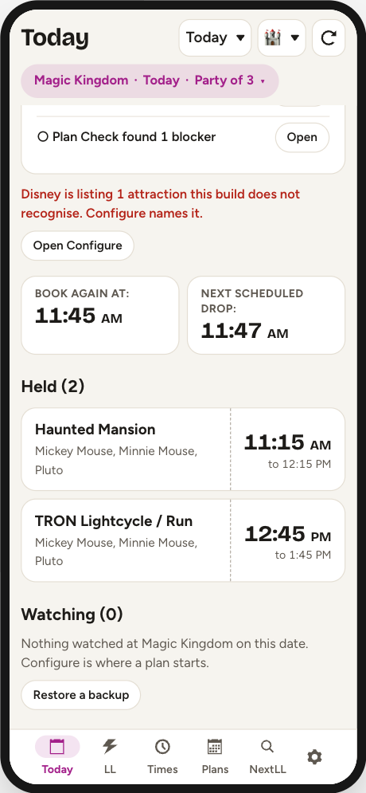

"Disney is listing 1 attraction this build does not recognise. Configure names
it." Disney has re-themed a ride and issued a new internal ID; the old one stops
appearing, and the new one is dropped silently — no row, no target, no alert.

Open **Configure** for the ID numbers. There is no fix inside the app. Check
your saved plan too: the target sits there looking armed, and Configure lists it
under "Not on today's list" with a remove button.

## A change that never came back

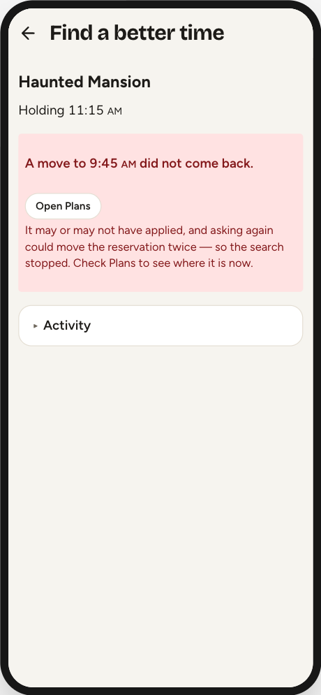

A booking request can leave the phone and never return: the park's wifi drops,
the response never arrives. It may have worked or it may not, and nothing
arriving later can tell you which. Retrying risks moving a reservation twice;
forgetting it leaves a pass unprotected.

So that reservation is **held**, and the hold is visible. Activity and Plan
Check both list it under a red panel, naming the attraction and what the change
was trying to do — "Move Haunted Mansion from 7:15 PM to 11:40 AM on March
5". Nothing touches that pass until Disney's own itinerary shows the exact
result the request asked for.

**Open Disney's Plans and look.** Then, if you want to release it yourself:
**I checked Disney — resolve this** → **Clear this protection**. It asks twice
because clearing it is the one action here that can cost you a reservation.

The protection can also clear itself: a later Plans refresh showing the exact
requested time resolves it with no tap from you.

## Common questions

**"Why is nothing booking?"** In order: is Dry run on (yellow banner)? Is
anything armed (`n armed` in Plan, not paused)? Is the refusal box showing? Did
it stop? Then read **Why nothing was booked** on Activity.

**"Why did it skip a time I wanted?"** Most likely the offered time fell outside
that attraction's window, or Avoid clashes refused it against a plan you already
hold — including dining, which the Timeline does not draw.

**"It booked something at a terrible time."** Check whether **Book then move**
is armed for it. That action ignores your window for the first booking by
design.

**"It gave away the wrong pass in a swap."** Swap in gives up the reservation
the *app* ranks worst, not the one with the highest Plan rank you typed.

## What it cannot do

**Walt Disney World Lightning Lane Multi Pass only.** Disneyland and virtual
queues were removed. AutoLL v1.0 still carries both; if you need to join a
boarding group, use Disney's app. A boarding group already in your itinerary
still displays here.

**Individual Lightning Lane is not booked.** Only Multi Pass.

**It cannot protect its own storage.** Everything AutoLL-5 keeps — your party,
your watch list, and what it has learned about drops — is stored by Safari for
Disney's website. Safari deletes a website's stored data after about a week of
Safari use without a visit to that site, and nothing warns you when it does.
**Back it up:** the gear at the bottom right, then **Backup and Restore**, then
**Back up now**. It saves one file — your plan, your party and every drop the
learner has seen — to Files, or AirDrops it to a computer. Your Disney sign-in
is never in it. The same menu says how long it has been since the last one.
**To put it back** — on a new phone, or after Safari has emptied this one — turn
Autopilot off, open **Backup and Restore**, then **Choose a backup file**. It
shows what the file holds before it changes anything, and **Replace this phone’s
plan** swaps in the file’s watch lists, party and starred attractions and adds
the file’s drops to what the phone has seen. Your sign-in and settings, dry run
included, stay as they are. Reload the page afterwards.
**Between trips, open AutoLL-5 at least once a week** as well, or it may start
empty next time.

**Rough edges, as of 1.4.1.** Known, recorded, and not fixed yet:

- The day timeline truncates every target name at 360 px, and its bars are
  14–20 px tall, which is a small tap target.
- Undoing two target removals in a row loses the first one's window and rank.
- A Plan Check item that names a setting opens Configure at the top of a long
  screen rather than at the setting.

These and everything else outstanding are in [docs/FUTURE.md](FUTURE.md), with
what each would cost to fix.

---

# Reference

## Checking speeds

| Mode | Interval | Trigger |
|---|---|---|
| Idle ("Watching") | 45 s | Nothing near |
| Approach ("Checking often") | 6 s | 5→2 min before a target, or inside a refill window |
| Burst ("Checking rapidly") | 1.2 s | T−2:00 to T+2:00 around a target |
| Tomorrow | 15 s | Booking date is tomorrow, 7am–10pm park time |
| NextLL quick search | 0.6 s | A hand-started book search |
| Time Search | 6 s | A hand-started time search |

Every interval is spread ±20% so the pattern is not perfectly regular. A date
further out than tomorrow gets no drop times at all and sits at 45 s.

## Limits and thresholds

| | |
|---|---|
| Requests | 5 per second per client, then a 5-second cooldown |
| Single check deadline | 90 seconds, then abandoned and counted as a failure |
| Backoff after a failure | 2 s doubling to a 60 s cap |
| Gives up after | 8 consecutive failures |
| Auto-move minimum gain | 30 minutes (1 minute for a NextLL target with a bound) |
| Time Search minimum gain | 5 minutes |
| Tier 1 hold horizon | 90 minutes |
| Protected span around a plan | 40 min before; 60 after with no end time, 40 with one; 20 before a show ends |
| Undo after Stop watching | 8 seconds, most recent removal only |
| Activity log | 20 rows |
| Drop learning | 2 distinct park days before a time is used |
| Party cap | 20 guests |

## What resets when

| Event | Effect |
|---|---|
| Turning Autopilot on | Clears session log, skip counts, refusal state, locks, cache, passkey status, drop baseline; re-alerts anything available |
| Turning Autopilot off | Leaves skip counts and the log alone |
| Page reload | Autopilot off; skip counts lost; log and watch list survive |
| 4am park-day rollover | Autopilot off; screen wake lock released; log emptied; skip counts zeroed |

## Glossary

**Multi Pass** — the Lightning Lane product this app books. Three at a time.

**Tier 1** — Disney's headliner group. One at a time until the party's first
redemption.

**Drop** — a scheduled release of extra inventory at a fixed minute.

**Refill window** — a span of hours over which an attraction trickles inventory
back, instead of dropping at an instant.

**Passkey** — an easy non-Tier-1 ride you mark to be booked and ridden first, to
clear the Tier 1 hold.

**Rank** — your own priority number for a target. Lower goes first. Blank falls
back to the built-in ranking.

**Protected time** — the span around a plan you hold that Autopilot treats as
spoken for.

**Dry run** — rehearsal: every check runs, nothing is booked.

**Quarantine / protection** — a hold placed on a reservation whose change got no
definite answer from Disney.

---

## Related documents

- [README.md](../README.md) — what this build is, and how to install it
- [ROADMAP.md](../ROADMAP.md) — what to do next, and in what order
- [docs/FUTURE.md](FUTURE.md) — everything outstanding, with what each would cost
- [FORK.md](../FORK.md) — why a plain upstream build does not run
- [SECURITY.md](../SECURITY.md) — token handling
